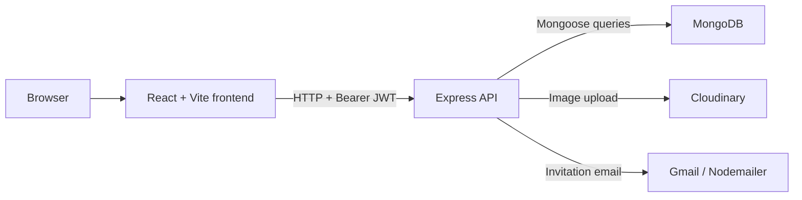
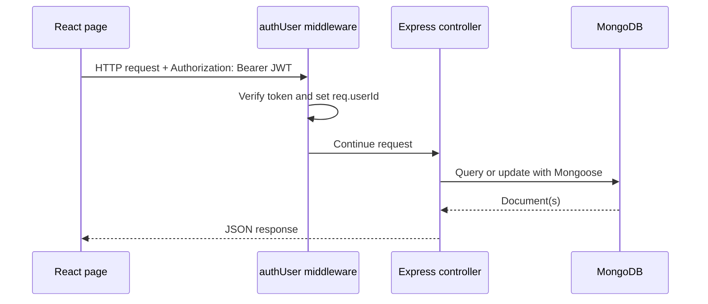
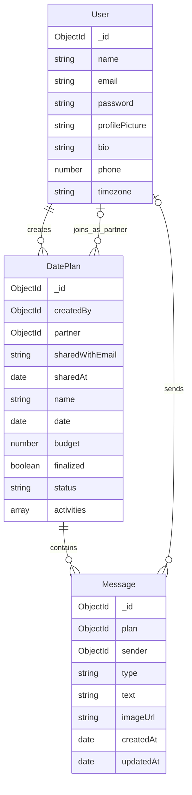
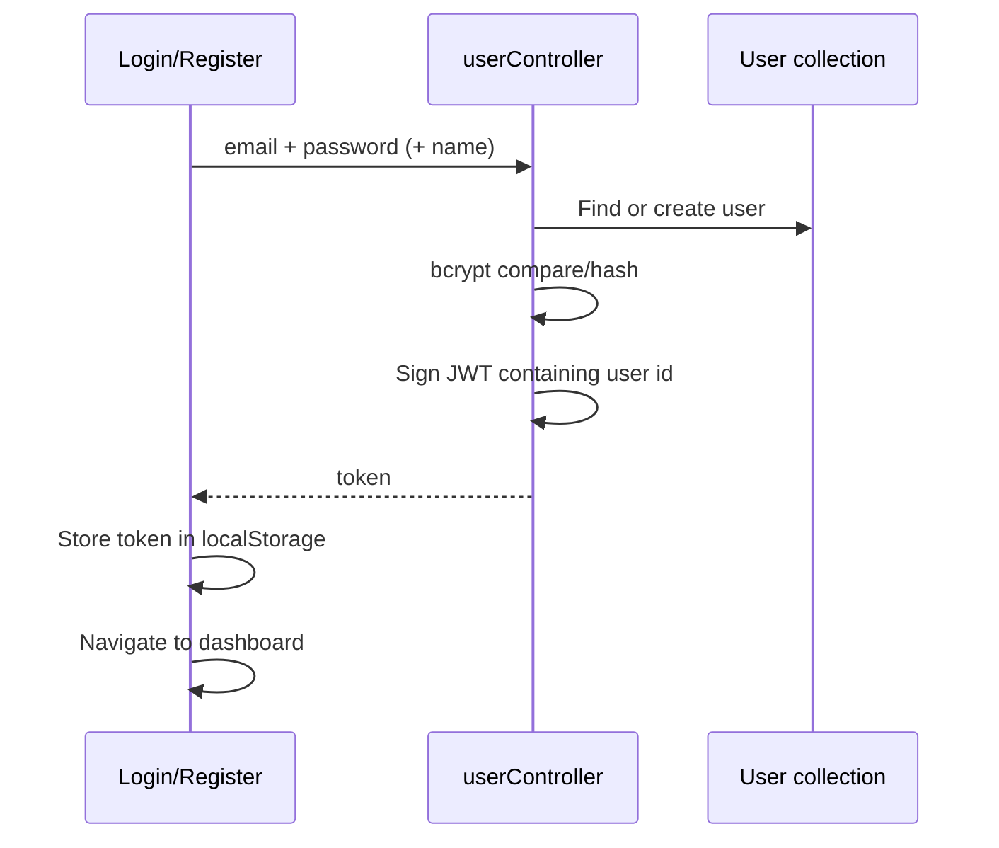

# DAYate Architecture and Learning Guide

This document explains how DAYate works today, where each responsibility
lives, how data moves through the system, and how to practice changing it.

## 1. Product Mental Model

DAYate helps one user plan a date and optionally collaborate with a partner.

The core lifecycle is:

```text
Register/login
    -> choose an activity
    -> create a draft DatePlan
    -> finalize the plan
    -> share it with another registered user
    -> both users can edit and chat
    -> chat images appear as memories in the calendar
```

The most important concept is `DatePlan`. It is the center of the application
and its model lives in `backend/modules/plans/plan.model.js`.

## 2. System Architecture

DAYate is a two-application repository:



There is no server-side rendering, websocket server, background worker, or
global frontend state store. The frontend is a client-side React SPA. The
backend is a JSON API. MongoDB is the source of truth.

### Request Path

Most protected requests follow this sequence:



## 3. Repository Map

```text
DAYate/
├── backend/
│   ├── modules/         Business modules: auth, plans, chat, calendar, share
│   ├── shared/          Shared configuration, middleware, and utilities
│   ├── server.js        Backend composition root and process entry point
│   └── .env.example     Required backend configuration
├── frontend/
│   ├── public/          Static public assets
│   ├── src/
│   │   ├── assets/      Images and small static datasets
│   │   ├── components/  Reusable UI and dashboard components
│   │   ├── hooks/       Dashboard data/state orchestration
│   │   ├── pages/       Route-level screens
│   │   ├── services/    API access extracted from UI
│   │   ├── App.jsx      Frontend route table
│   │   └── main.jsx     Browser entry point
│   └── .env.example     Frontend API URL
└── docs/                Architecture documentation
```

## 4. Runtime Startup

### Frontend startup

1. Vite loads `frontend/index.html`.
2. `frontend/src/main.jsx` mounts React into the `root` DOM element.
3. `BrowserRouter` enables client-side routing.
4. `App.jsx` renders the global `Navbar` and selects a page for the URL.
5. Pages make API requests directly or through a service/hook.

### Backend startup

1. `backend/server.js` loads environment variables through `dotenv/config`.
2. It creates an Express application.
3. It configures Cloudinary and awaits the MongoDB connection.
4. It installs JSON parsing and CORS middleware.
5. It mounts routers exported by the business modules.
6. It listens on `PORT`, defaulting to `5001`.

The API does not begin listening until the database connection succeeds.

## 5. Frontend Architecture

### Routing and access

`frontend/src/App.jsx` is the route table.

Public routes:

| URL | Screen | Purpose |
|---|---|---|
| `/` | `Home` | Landing page |
| `/login` | `Login` | Authenticate |
| `/register` | `Register` | Create an account |
| `/about` | `About` | Product description |
| `/contact` | `Contact` | Static contact form |

Protected routes:

| URL | Screen | Purpose |
|---|---|---|
| `/dashboard` | `Dashboard` | Summary and upcoming plans |
| `/activities` | `Activites` | Planning choices |
| `/cafes` | `Cafes` | Static cafe catalog |
| `/cafes/:id` | `CafeReservation` | Create a cafe plan |
| `/book-rides` | `BookRides` | Create a ride plan |
| `/gifts` | `Gifts` | Static gift catalog |
| `/my-plans` | `MyPlans` | Draft plans and finalization |
| `/share`, `/planned-dates` | `SharePlan` | Finalized plan sharing/editing |
| `/chat` | `Chat` | Shared-plan conversations |
| `/date-calendar` | `DateCalendar` | Photos grouped by plan date |
| `/profile` | `Profile` | Current user profile |

`ProtectedRoute` only checks whether a token string exists in `localStorage`.
It does not verify the token. Actual security is enforced by backend
middleware. An expired token can therefore open the page shell before API
requests fail.

### Frontend state

The application uses local component state with `useState` and effects with
`useEffect`. There is no Context provider, Redux store, or query-cache library.

Most pages own all of their concerns:

- request construction
- loading/error state
- response handling
- form state
- UI rendering

The dashboard is the main exception:

```text
Dashboard page
    -> useDashboard hook
        -> dashboardService
            -> /api/user/profile
            -> /api/plan/list?scope=accessible
```

This is the strongest existing pattern to follow for future frontend work:
keep request details in a service, transformation/state in a hook, and
presentation in components.

### Authentication in the browser

1. Login or registration sends credentials to the API.
2. The API returns a signed JWT.
3. The frontend stores it under `localStorage["token"]`.
4. Protected requests send `Authorization: Bearer <token>`.
5. Logout deletes the token.

There is no refresh-token flow, session expiration UI, or centralized API
client. Each page currently builds its own headers.

### API base URL

Frontend files use:

```js
import.meta.env.VITE_API_URL || "https://dayate-zw7n.onrender.com"
```

For local development, `frontend/.env` should contain:

```text
VITE_API_URL=http://localhost:5001
```

## 6. Backend Architecture

The backend is organized as a modular monolith. Each business module owns its
routes, controllers, services, and models:

```text
server.js
    -> module route
        -> middleware
            -> controller
                -> service
                    -> module-owned model / another module's public API
```

Current modules are `auth`, `plans`, `chat`, `calendar`, and `share`. Modules
expose selected operations through `index.js`; their models should remain
private.

### Composition root: `server.js`

`server.js` owns application-wide setup:

- Express application creation
- MongoDB initialization
- Cloudinary initialization
- JSON request parsing
- CORS policy
- router mounting
- HTTP listener

Allowed CORS origins include localhost, the deployed Vercel frontend, and
comma-separated origins from `CLIENT_URLS` or `CLIENT_URL`.

### Authentication middleware

`authUser`:

1. Reads the bearer token from `Authorization`.
2. Verifies it with `JWT_SECRET` or `JWT_SECRET_KEY`.
3. writes the decoded user id to `req.userId`.
4. calls the next handler.

Controllers use `req.userId` both to assign ownership and to restrict queries.

### Module responsibilities

- `auth`: registration, login, profiles, JWT creation, and the `User` model
- `plans`: plan lifecycle, authorization queries, and the `DatePlan` model
- `chat`: messages, system messages, uploads, and the `Message` model
- `calendar`: read-only coordination of accessible plans and chat images
- `share`: coordinates plans, users, email invitations, and system messages

## 7. Data Model

### Relationships



### User

Source: `backend/modules/auth/user.model.js`

- `email` is unique.
- `password` stores a bcrypt hash, never the original password.
- optional profile fields exist but are mostly unused by the UI.
- the schema does not enable timestamps.

### DatePlan

Source: `backend/modules/plans/plan.model.js`

This is the aggregate root of the product. It owns:

- creator and optional partner
- sharing metadata
- date name, day, budget, and lifecycle status
- an embedded array of activities

Plan status values:

```text
draft -> planned -> in_progress -> completed
                    \-> cancelled
```

The code does not strictly enforce transitions. A permitted editor can set any
allowed status directly.

Activity types:

```text
ride | restaurant | spa | movie | other
```

Activity booking statuses:

```text
pending | confirmed | failed
```

### Message

Source: `backend/modules/chat/message.model.js`

A message belongs to a plan, making each shared plan its own conversation.
Messages may be:

- `text`: text from a user
- `image`: a Cloudinary image, optionally with text
- `system`: generated when a plan is shared, finalized, or edited

The `sender` is null for system messages.

## 8. API Reference

All protected endpoints expect:

```http
Authorization: Bearer <jwt>
```

Most responses use:

```json
{
  "success": true,
  "message": "Optional message",
  "data": {}
}
```

The API does not consistently use HTTP error status codes, so clients normally
must inspect `success`.

### User API

Base path: `/api/user`

| Method | Path | Access | Behavior |
|---|---|---|---|
| `POST` | `/register` | Public | Validate, hash password, create user, return JWT |
| `POST` | `/login` | Public | Check password and return JWT |
| `GET` | `/profile` | User | Return current user without password |
| `PUT` | `/profile` | User | Update selected profile fields |
| `POST` | `/admin` | Public | Stub; currently never responds |

### Plan API

Base path: `/api/plan`

| Method | Path | Access rule | Behavior |
|---|---|---|---|
| `POST` | `/add` | Authenticated user | Create a draft plan owned by caller |
| `GET` | `/list` | Creator by default | List plans; supports `finalized` and `scope=accessible` |
| `POST` | `/finalize` | Creator only | Set selected drafts to finalized/planned |
| `POST` | `/share` | Creator only | Attach registered partner, email them, add system message |
| `PATCH` | `/:planId` | Creator or partner | Update allowed plan fields and add system message |
| `DELETE` | `/:planId` | Creator only | Delete plan and all its messages |

`GET /list` query behavior:

```text
no scope              -> plans created by current user
scope=accessible      -> plans created by or shared with current user
finalized=true        -> only finalized plans
finalized=false       -> only draft plans
```

### Chat API

Base path: `/api/chat`

| Method | Path | Access rule | Behavior |
|---|---|---|---|
| `GET` | `/` | Creator or partner | List shared plans as chat rooms |
| `GET` | `/calendar` | Creator or partner | List accessible plans that have image messages |
| `GET` | `/:planId/messages` | Creator or partner | Return up to 200 messages |
| `POST` | `/:planId/messages` | Creator or partner | Send text and/or one image |

Images are accepted through multipart form data under the field `image`.
The maximum size is 8 MB. Images are uploaded to `dayate/chat` in Cloudinary.

Chat is not realtime. The frontend polls the messages endpoint every four
seconds.

## 9. Feature Flows

### Registration and login



### Create and finalize a plan

Cafe reservation and ride booking both call `POST /api/plan/add`.

The controller creates one `DatePlan` with one embedded activity. New plans
default to `finalized=false` and `status=draft`. `MyPlans` loads draft plans,
lets the creator select them, then calls `/api/plan/finalize`. Finalizing sets:

```text
finalized = true
status = planned
```

### Share a plan

1. `SharePlan` loads creator-owned finalized plans.
2. Creator enters a partner email.
3. Backend finds the plan and a registered user with that email.
4. Backend prevents self-sharing and sharing with a second partner.
5. Backend stores the partner and sharing metadata.
6. Backend sends an invitation email through Gmail/Nodemailer.
7. Backend creates a system message.
8. The plan now appears in both users' chat and accessible-plan queries.

Email sending is synchronous. If email delivery fails after the plan is saved,
the endpoint reports failure even though the partner may already be attached.

### Edit a shared plan

Creator or partner may update:

```text
name, date, budget, status, activities
```

The backend compares old and new values, saves the changes, and creates a
human-readable system chat message when the plan has a partner.

### Chat and memories

1. `Chat` lists shared plans and gets the current user's profile.
2. Selecting a plan loads its messages.
3. The page polls messages every four seconds.
4. Text is stored in MongoDB.
5. Image bytes are uploaded to Cloudinary; the returned URL is stored in
   MongoDB.
6. `DateCalendar` calls `/api/chat/calendar`.
7. The backend groups image messages under accessible plans.
8. The frontend groups those plans by the plan's date.

Deleting a plan also deletes its MongoDB message records, but it does not
delete the corresponding Cloudinary image assets.

### Dashboard

The dashboard requests profile and accessible plans in parallel. The frontend
then calculates:

- created plans
- upcoming non-cancelled plans
- completed plans
- shared plans

These are derived client-side, not stored counters.

## 10. Authorization Rules

Understanding ownership is essential:

| Action | Creator | Partner | Other user | Public |
|---|---:|---:|---:|---:|
| Create plan | Yes | Yes, as creator of a new plan | Yes, as creator | No |
| View default plan list | Own only | Own only | Own only | No |
| View accessible plan list | Yes | Yes | No | No |
| Finalize plan | Yes | No | No | No |
| Share plan | Yes | No | No | No |
| Edit shared plan | Yes | Yes | No | No |
| Delete plan | Yes | No | No | No |
| Read/send chat | Yes | Yes | No | No |
| View chat images/calendar | Yes | Yes | No | No |

Do not rely on frontend route protection for authorization. Every sensitive
backend query must include creator/partner restrictions.

## 11. External Services and Configuration

### Backend environment

| Variable | Purpose |
|---|---|
| `MONGODB_URL` | Base MongoDB connection URL; `/DAYate` is appended |
| `JWT_SECRET_KEY` | JWT signing and verification secret |
| `CLOUDINARY_NAME` | Cloudinary cloud name |
| `CLOUDINARY_API_KEY` | Cloudinary API key |
| `CLOUDINARY_SECRET_KEY` | Cloudinary API secret |
| `EMAIL_USER` | Gmail sender account |
| `EMAIL_PASS` | Gmail app password |
| `CLIENT_URLS` | Comma-separated allowed frontend origins |
| `PORT` | Optional API port; defaults to `5001` |

The code also supports `JWT_SECRET` and `CLIENT_URL` as alternate names.

### Frontend environment

| Variable | Purpose |
|---|---|
| `VITE_API_URL` | Backend API origin |

Never place backend secrets in a `VITE_` variable. Vite exposes those values to
the browser bundle.

## 12. Current Gaps and Risks

These are important for learning the real state of the project:

1. **Input validation is limited.**
   Most plan/chat/profile inputs are accepted directly. Add schema validation
   at the API boundary before growing the product.

2. **HTTP status and error handling are inconsistent.**
   Many failures return HTTP 200 with `success:false`. There is no global error
   handler.

3. **JWT handling is basic.**
   Tokens have no explicit expiration and live in `localStorage`. There is no
   refresh flow or revocation.

4. **Sharing has a partial-failure risk.**
   The plan is saved before email is sent. Email failure can leave sharing
   completed while the API reports an error.

5. **Chat polling does not scale like realtime messaging.**
   Every open chat sends a request every four seconds. WebSockets or
   server-sent events would be a later architectural upgrade.

6. **Cloudinary deletion is missing.**
   Deleting plans/messages leaves uploaded images in Cloudinary.

7. **No automated tests exist.**
   Changes currently depend on manual verification.

8. **Some UI paths are unfinished or inconsistent.**
    Gifts and contact are static, ride creation navigates to the nonexistent
    `/my-planned-dates` route, and cafe reservation uses a hard-coded 2026 date
    when constructing activity time.

9. **Profile update and schema do not fully agree.**
    The controller writes `address`, but the user schema does not define it.

10. **No database indexes support common plan queries.**
    As data grows, indexes on `createdBy`, `partner`, `date`, and `finalized`
    will matter.

## 13. How to Read the Code

Use this order to build a correct mental model:

1. Read `frontend/src/App.jsx` to see the user-facing capabilities.
2. Read `backend/server.js` to see the API boundaries.
3. Read each module's `index.js` and route file to learn the public boundaries.
4. Read the models inside `modules/plans`, `modules/auth`, and `modules/chat`.
5. Trace `POST /api/plan/add` from a frontend page through route, middleware,
   controller, and model.
6. Trace sharing through `modules/share`.
7. Trace chat access through `modules/chat`.
8. Read `dashboardService.js` and `useDashboard.js` as the cleanest frontend
   data-flow example.
9. Read `SharePlan.jsx` and `Chat.jsx` to understand the more complex pages.
10. Revisit the gaps list and confirm each item in code.

When tracing any feature, answer:

```text
What user action starts it?
Which frontend component owns the state?
What exact HTTP request is sent?
Which middleware runs?
How is authorization enforced?
Which controller executes?
Which collections are read or changed?
What response shape returns?
How does the UI update?
What can fail between each step?
```

## 14. Practice Roadmap

Complete these in order. Each exercise builds on the previous one.

### Level 1: Observe and explain

1. Register two local users.
2. Create and finalize a cafe plan with user A.
3. Share it with user B.
4. Edit it as user B and observe the system chat message.
5. Send an image and find it in the date calendar.
6. For every step, write down the request URL, payload, controller, and
   database change.

### Level 2: Small safe changes

1. Fix the ride success navigation from `/my-planned-dates` to `/my-plans`.
2. Show the user's name, bio, and timezone on the profile page.
3. Add an empty-state message when a chat has no messages.
4. Extract the repeated API URL and authorization-header logic into one
   frontend API client.

### Level 3: Backend correctness

1. Add request validation for registration and plan creation.
2. Standardize status codes and add a global Express error handler.
3. Add plan query indexes.

### Level 4: Testing

Add tests in this order:

1. Unit-test dashboard calculations.
2. Integration-test registration and login.
3. Integration-test creator/partner/outsider plan permissions.
4. Integration-test plan sharing and system messages.
5. Integration-test deleting a plan and its messages.

The most valuable security test is:

```text
Given a plan owned/shared by users A and B,
when user C requests or edits it,
then the API must deny access.
```

### Level 5: Architectural upgrades

1. Move the remaining plan business logic from controllers into services.
2. Make email delivery asynchronous and retryable.
3. Add realtime chat with WebSockets.
4. Delete Cloudinary assets when their messages/plans are deleted.
5. Introduce explicit plan state-transition rules.

## 15. Debugging Playbook

When something fails, debug in layers:

1. **Browser route:** Is the page protected? Is the URL valid?
2. **Browser console/network:** What request, payload, status, and JSON came
   back?
3. **Authentication:** Does `localStorage` contain a token? Is the bearer
   header present?
4. **CORS:** Is the frontend origin listed in `CLIENT_URLS`?
5. **Route:** Does the method/path match a backend router?
6. **Middleware:** Did `authUser` set `req.userId`?
7. **Authorization query:** Does the query correctly include creator/partner?
8. **Validation/model:** Does the payload match the Mongoose schema enums and
   required fields?
9. **External service:** Are Cloudinary or Gmail credentials configured?
10. **Database:** Did the intended document actually change?

Useful manual checks:

```bash
# Frontend compile check
cd frontend && npm run build

# Frontend lint check
cd frontend && npm run lint

# Start the API with reload
cd backend && npm run server
```

## 16. Architectural Direction

The project is currently a modular monolith split into a frontend SPA and one
backend API. That is the right deployment shape for its current size. The next
step should not be microservices. The highest-value improvements are clearer
domain naming, consistent validation/error handling, centralized frontend API
access, and automated authorization tests.

The architectural invariant to protect is:

> A DatePlan is owned by one creator, may have one partner, and only those two
> users may access its collaborative details, messages, and memories.

If every future feature preserves that rule and keeps `DatePlan` as the clear
domain center, the system will remain understandable as it grows.
